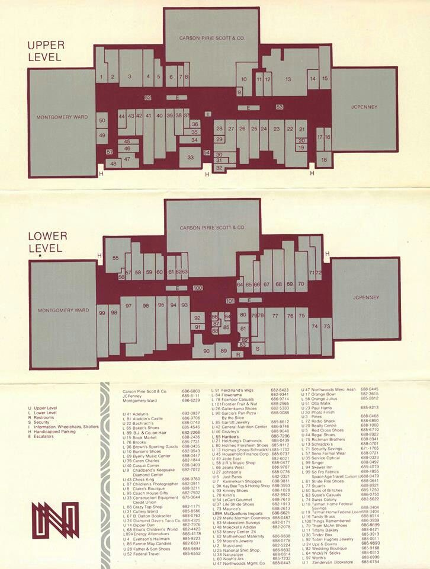
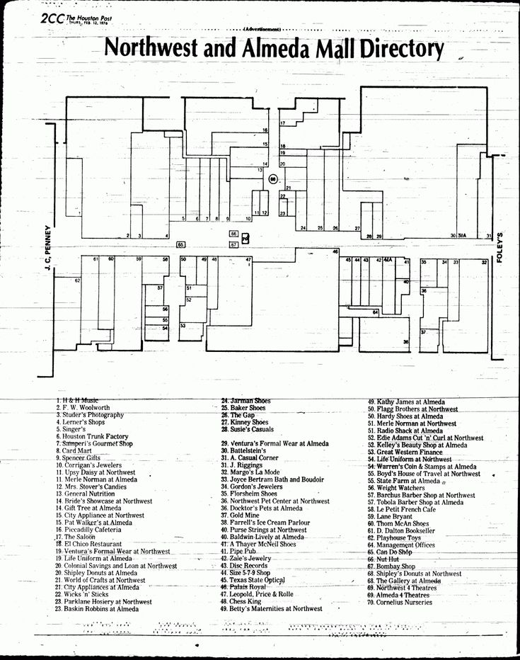

# Mall Directory Archive Project

As one of the youngest Gen Xers (born July 1, 1979), I caught the tail end of the golden arcade era. While the arcade boom peaked from 1976 to 1984, my formative mall memories come from the mid-to-late 1980s—particularly at Northlake Mall in Tucker, Georgia, the nostalgic epicenter of my childhood. Unable to locate exact details about Northlake's layout and store directory from that era, I've turned to newspapers.com to scour archives across various states for mall directories from similar shopping centers. These small newspaper directory ads are invaluable resources: they show store layouts, relative sizes, and complete tenant lists—all in one place—enabling detailed research into what these storefronts looked like, their inventory, and interior designs.

The ultimate goal of this project is to create an accurate VRChat world that recreates these lost spaces. While I'd love to rebuild Northlake Mall circa 1987, I'd rather work from actual historical records than create a vague, inaccurate approximation. If I can find comprehensive documentation of a similar mall from that era, I'll recreate that one instead. My ideal mall must include certain quintessential stores: RadioShack for electronics, an arcade (like Aladdin's Castle or Gold Mine), a pre-Barnes & Noble bookstore (B. Dalton Bookseller, Waldenbooks), classic anchor stores (Sears, JCPenney, Macy's, Davison's/Rich's, Service Merchandise, or Dillards), and crucially, a record store like Turtles Records and Tapes or Camelot Music. This archive documents my findings as I search for the perfect mall to bring back to virtual life.

---

## Goals

* Collect high-quality scans or photographs of mall directories from the **1980s–1990s**, with a focus on the **late 1980s (1985–1989)**.
* Identify each mall (location, anchors, notable inline stores).
* Narrow down the **date range** of each directory using anchor stores and chain histories.
* Record the **criteria** that help confirm the approximate date.
* Use findings to choose one or more directories for a faithful reproduction project.

---

## Criteria for Ideal Directory (Late 1980s Nostalgia)

* **Arcade**: Must include an arcade (e.g., **Aladdin’s Castle**, **Goldmine**, etc.).
* **Music Store**: Should have a records/tapes store. Mentions of vinyl and cassette tapes are ideal; CDs are less desirable.
* **Electronics**: Must include a **Radio Shack**.
* **Bookstore**: Preferably a now-defunct mall bookstore chain like **Waldenbooks** or **B. Dalton Bookseller**.
* **Trendy/Youth Stores**: Stores like **Gadzooks** or **Spencer’s Gifts** are a plus.
* **Anchor Stores**: Ideally should include at least some of the classic big anchors of the era:

  * **Macy’s**
  * **Sears**
  * **JCPenney**
  * Regional anchors (e.g., Carson Pirie Scott, Montgomery Ward) acceptable
* **Mall Demographic**: Should feel **middle-class accessible**, not overly high-end or luxury.

---

## Northwoods Mall (Peoria, Illinois)



* **Mall**: Northwoods Mall, Peoria, Illinois
* **Anchors**: Carson Pirie Scott, Montgomery Ward, JCPenney
* **Notable Stores**:

  * Aladdin’s Castle (arcade)
  * B. Dalton (bookstore)
  * Musicland (records/tapes)
  * Radio Shack (electronics)
  * Afterthoughts, The Limited, The Gap, Casual Corner, Fannie May, Sbarro, Kinney Shoes
* **Dating Evidence**:

  * **Afterthoughts** → Popular in early 1990s, merged into Claire’s \~2000
  * **Kinney Shoes** → Closed in 1998
  * **Montgomery Ward** → Still open, closed in 2001
  * **Anchors intact** and **tenant mix typical of mid-90s**
* **Estimated Date Range**: **1992–1997**
* **Notes**: Directory provides good nostalgic value, but slightly later than the target late 1980s window. If a version from \~1987–1989 can be located, it would be ideal.

---




## Northwest and Almeda Mall (Houston, Texas)

* **Mall**: Northwest and Almeda Mall, Houston, Texas
* **Date**: February 12, 1976 (from The Houston Post)
* **Anchors**: JCPenney, Foley’s
* **Store List** (single-level mall; numbering preserved to match map):

```
1. H. H. Moss
2. F. W. Woolworth
3. Sturter’s Photography
4. Lerner’s Shops
5. Singer’s
6. Houston Trunk Factory
7. Strempel’s Gourmet Shop
8. Card Mart
9. Spencer Gifts
10. Oprincaj’s Jewelers
11. Tipsy Daisy’s at Northwest
12. Mrs. Newman at Almeda
13. Mrs. Sowar’s Candies
14. General Nutrition
15. Bride’s Showcase at Northwest
16. Gift Tree at Almeda
17. City Appliance at Northwest
18. Pet World
19. Piccadilly Cafeteria
20. The Shoe Salon
21. Zales Jewelers
22. Victoria’s Formal Wear at Northwest
23. LoLo Uniforms at Almeda
24. Janitor Shoes
25. Baker Shoes
26. The Gap
27. Kinney Shoes
28. Susie’s Casuals
29. Ventura’s Formal Wear at Almeda
30. Battelstein’s
31. A. Casual Corner
32. J. Rigging
33. Margo’s La Mode
34. Joyce Berman Bath and Boudoir
35. Gordon’s Jewelers
36. Fischerman’s
37. Northwest Pet Center at Northwest
38. Doctor’s Pets at Almeda
39. Gold Grill
40. Purse Strings at Northwest
41. Barbara Maye at Almeda
42. Naturalizer Shoes
43. E. P. The Jeweler
44. House of Vision Optical
45. Kay Jewelers
46. Gem Optical
47. Gloria’s Wig Shop
48. Eagle Shoe
49. Kathy James at Almeda
50. Flag Brothers at Northwest
51. Hardy Shoes at Almeda
52. Thom McAn at Northwest
53. Radio Shack at Almeda
54. Selden Glass Out ’n’ Curl at Northwest
55. Becky Beauty Shop at Almeda
56. Great Western Finance
57. LoLo Uniforms at Northwest
58. Warner’s Coin & Stamps at Almeda
59. Judge’s House of Travel at Northwest
60. Harold’s
61. Weight Watchers
62. Barbara Lee Shop at Northwest
63. Petite Parenté Café
64. LoLo Uniforms
65. Continental
66. B. Dalton Bookseller
67. Waldenbooks
68. Spencer Gifts
69. Pet Shop
70. Radio Shack at Northwest
71. Mrs. Newman at Northwest
72. Selden Glass Out ’n’ Curl at Almeda
73. Almeda Twin Theatres
74. Cornelius Nurseries
```

---